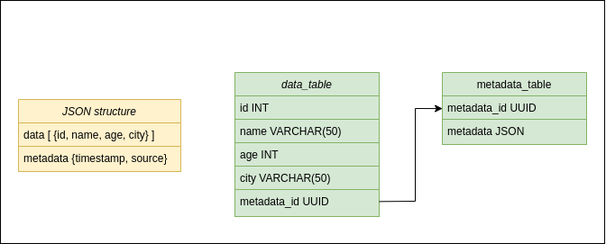
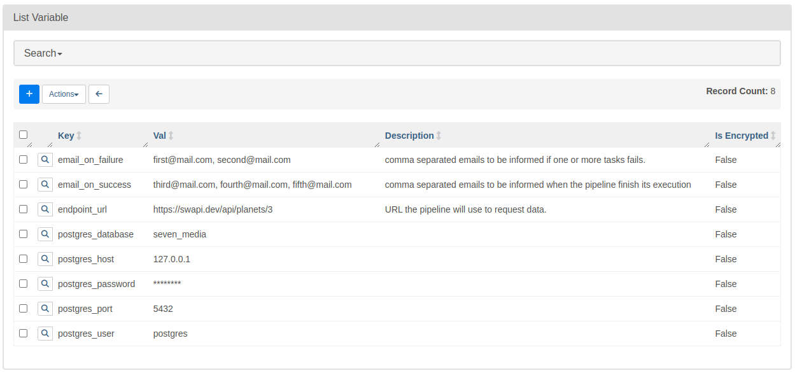
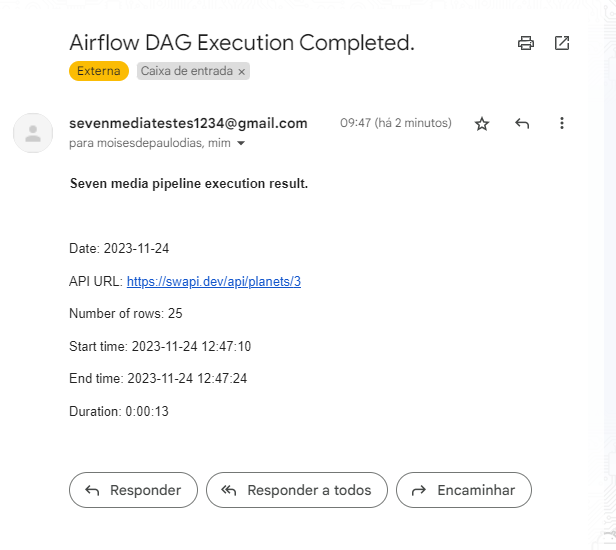
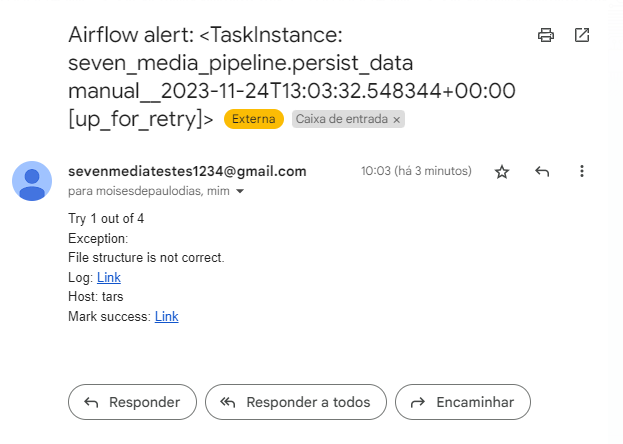

## Airflow Data Pipeline Challenge

### Overview

This README provides an overview of the data pipeline developed using Python to retrieve data from an API, store it in a PostgreSQL database, and send notifications via email after the execution finishes. The pipeline consists of five operators:

#### Operators

1. **check_api_availability (HttpSensor)**

    Checks for the API data availability before requesting the API.
   
2. **request_data (PythonOperator)**
    
    Perform a request in the API and save the data locally in a json file.

3. **persist_data (PythonOperator)**
    
    Store the result of the request into two PostgreSQL tables, one for the data and other for the metadata of the request. (Additional details can be found in the Table Modeling section).

4. **generate_logs (PythonOperator)**

    Get metadata about the DAG execution (start and end time, requested URL, execution duration) and constructs an email content.

5. **send_email_with_status (EmailOperator)**

    Sends an email to stakeholders with relevant information.

### Table Modeling


The expected JSON structure has two keys: `data` which contains a list of objects representing with the keys `id`, `name`, `age` and `city`. And `metadata`, containing additional request information such as `timestamp`, `source` and any other fields that may be included.

Based on this structure, two tables were created: **`data_table`**, with the columns `id`, `name`, `age`, `city` and `metadata_id`. And also **`metadata_table`**, with the columns `metadata_id` and `metadata`. The type of the column `metadata` is JSON because the number of fields inside it can change in different requests.

The second table, **`metadata_table`**, is necessary because in cases where we need to locate the source or date due to errors, inconsistencies or auditioning, these informations (load date and source) are very important and should be available.

The decision to use two tables (data_table and metadata_table) was made to avoid data redundancy. For instance, assuming a request may return 1000 rows with 10kB of metadata, we prevent repeating this 10kB of metadata for each row, resulting in 10MB of redundant data. Instead, we write this metadata once and use the metadata_id field to link the data to its corresponding metadata.


### Parameters

All the parameters used in the DAG, such as the API URL, email addresses and database credentials are stored in Airflow variables. This way, they can be changed without needing to modify the code.




### Email notification

When the DAG finishes its execution, all the emails specified in the Airflow variable `email_on_success` will receive a message containing relevant information about the execution:



### Error Handling

All the operators have a retry mechanism to handle transient errors. Additionally, in the event of execution failure, the operators will send email notifications to all the emails specified in the Airflow variable `email_on_failure`. The "persist data" step also validates the API request result structure to ensure consistency with the predefined table schema, preventing incorrect data from being inserted into the tables.

Here is an example of the error message when the API request result structure is not the expected:



### Setup

This DAG was tested in an **Ubuntu 22.04 with Python v3.10.12, PostgreSQL v14.9 and Airflow v2.7.3**. For running this DAG you need to configure an email in `airflow.cfg` to send the notifications. And create the following Airflow variables:

- `email_on_failure`: Comma separated emails to be informed if one or more tasks fails.
- `email_on_success`: Comma separated emails to be informed when the pipeline finish its execution.
- `endpoint_url`: URL the pipeline will use to request data.
- And postgres connection properties:
    - `postgres_user`
    - `postgres_password`
    - `postgres_host`
    - `postgres_port`
    - `postgres_database`


Inside the Postgres database that you will connect using the credentials stored in Airflow Variables, you need to create two tables as follows:

```
CREATE TABLE data_table (
    id INT,
    name VARCHAR(50),
    age INT,
    city VARCHAR(50),
    metadata_id UUID
);

CREATE TABLE metadata_table (
    metadata_id UUID,
    metadata JSON
);
```
